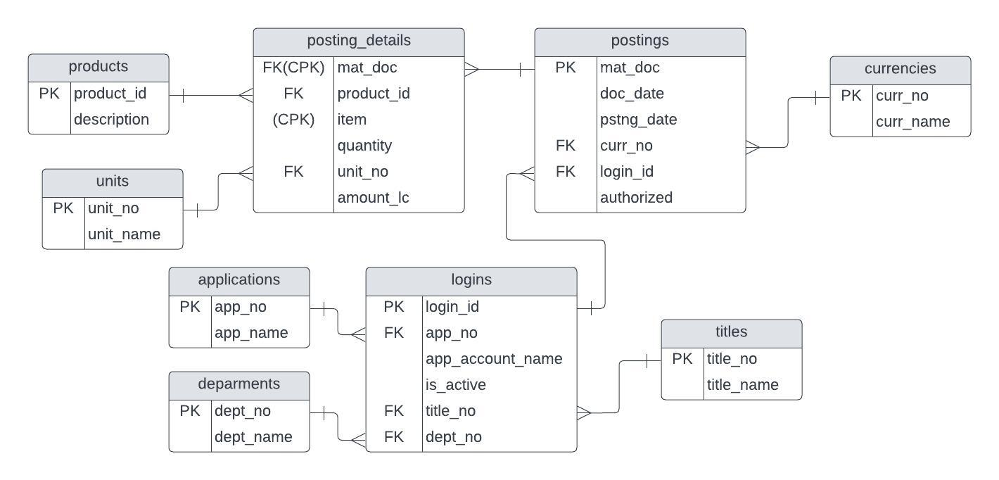

# internship-test-a1

## Task 1

<details>
<summary>Solution</summary>

````java
/*
* Функция преобразования строкового представления в int32.
* Функция реализована с учетом того, что параметр "address" является допустимым, т.е. соответсвует
* шаблону (regex): ^(25[0-5]|\b2[0-4][0-9]|\b[01]?[0-9][0-9]?)(\.(25[0-5]|2[0-4][0-9]|[01]?[0-9][0-9]?)){3}$
* Идея: IpV4-адрес состоит из четырех октетов, разделенных ".". Разобьем строку на октеты (split("\\.").
* Октет можно рассматривать в качестве битовой маски, которую можно сопоставить с итоговым числом.
* Для того чтобы установить в числе нужные биты, необходимо применить битовую операцию "или" между числом
* (все биты в числе должны быть сброшены) и октетом и затем применить операцию битового сдвига влево (на 8 бит),
* для того чтобы применить маску следующего октета.
*/

public static int parseStringToInt(String address) {
        int res = 0;

        for (String octet : address.split("\\.")) {
                res <<= 8;
                res |= Integer.parseInt(octet);
        }

        return res;
}

/*
* Функция преобразования значения int32 в строковое представление.
* Идея: необходимо получить строковое представление IpV4-адреса. Составим шаблон итоговой строки. На место
* каждого спецификатора (%d) необходимо подставить числовое значение каждого октета. Для того чтобы получить
* необходимые биты каждого октета нужно осуществить побитовый сдвиг числа на необходимое число бит
* (старший октет - сдвиг на 24 бита, младший октет сдвигать не нужно) и применить битовую операцию "и"
* с битовой маской 0xFF (младшие 8 бит этой маски установлены в 1). После этого все установленные биты
* будут рассмотрены спецификатором как целое число в диапазоне [0-255].
*/

public static String parseIntToString(int address) {
        return String.format("%d.%d.%d.%d",
                ((address >> 24) & 0xFF), ((address >> 16) & 0xFF),
                ((address >> 8) & 0xFF),  (address & 0xFF));
}
````

</details>

## Task 2

<details>
<summary>Solution</summary>

````java
/*
* lim( un = (1/n!) * (1! + 2! + 3! + ... + n!) ) = 1, при n -> +inf
*
* Док-во:
*       используемые свойства:
*               1) n! = (n - 1)! * n
*               2) lim(f(x) + g(x)) = lim(f(x)) + lim(g(x))
*
*       Преобразуем выражение un:
*               un = (1/n!) * (1! + 2! + 3! + ... + n!) =
*
*               = 1/n! + 2/n! + 6/n! + ... + (n-2)!/n! + (n-1)!/n! + n!/n! =
*
*               = 1/n! + 2/n! + 6/n! + ... + 1/((n-1)*n) + 1/n + 1;
*
*       Получим:
*               un = 0 + 0 + 0 + ... + 0 + 0 + 1 = 1, при n -> +inf
*
* Function:
*       Time Complexity: O(n)
*       Space Complexity: O(1), не учитывая внутреннюю реализацию BigDecimal
*       n - число, для которого расчитывается значение функции
*/

public static double calculateFunValue(int n) {
        BigDecimal f = BigDecimal.ONE; // значение факториала
        BigDecimal s = BigDecimal.ONE; // значение суммы факториалов

        for (int i = 2; i <= n; i++) {
                f = f.multiply(BigDecimal.valueOf(i));
                s = s.add(f);
        }

        return s.divide(f,6,RoundingMode.HALF_UP).doubleValue();
}
````

</details>

## Task 3

<details>
<summary>Details</summary>

###### Stack
    - Java 17
    - Spring Boot
    - Spring Data JPA
    - PostgreSQL 15.1
    - OpenCSV library - .csv files parsing

###### Database Schema


</details>